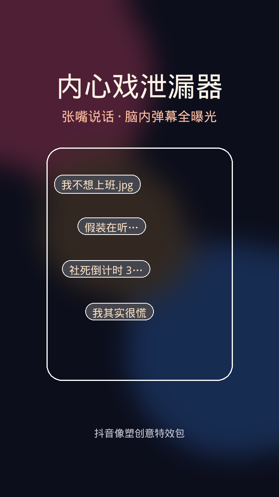

# 内心戏泄漏器

抖音像塑创意特效包：张嘴说话时，搞笑「脑内弹幕」全屏泄漏；闭嘴立刻变回「表面淡定」。



## 创意一句话

**嘴在社交，脑在吐槽。**

适合口播翻车、整蛊朋友、职场吐槽。越一本正经地讲话，弹幕越社死。

## 玩法

| 状态 | 触发 | 画面 |
| --- | --- | --- |
| 表面淡定 | 闭嘴 | 头顶徽章 + 思考泡泡 |
| 内心戏泄漏 | 张嘴 | 随机脑内弹幕飞入 + 冷汗 |
| 社死模式 | 张大嘴 / 连续说 | 顶部警报条 + 满屏弹幕 |
| 装可爱（可选） | 微笑 | 「我是不是很好看」 |

## 目录

```text
douyin-effect-neixinxi/
├── assets/           # 可直接导入像塑的 PNG 贴纸
├── release/          # 发布用素材压缩包
├── preview/          # 浏览器可交互预览（摄像头 / 模拟按钮）
├── scripts/          # 重新生成素材
├── effect-spec.json  # 玩法与资源清单
├── XIANGSU_GUIDE.md  # 像塑逐步复刻指南
├── PUBLISH.md        # 抖音特效平台提交清单（需本机像塑登录）
└── README.md
```

## 发布到抖音

抖音**只允许**在像塑客户端内登录后点「提交特效」，云端无法代发。  
完整步骤与可复制文案见 [PUBLISH.md](./PUBLISH.md)；素材包：`release/内心戏泄漏器-像塑素材包.zip`。

## 立刻预览

在仓库根目录执行：

```bash
npx --yes serve douyin-effect-neixinxi/preview -p 5173
```

打开 `http://localhost:5173`：

1. 点 **开启摄像头**（需授权）对着镜头张嘴；或  
2. 直接点 **模拟张嘴 / 社死模式** 看效果。

## 导入像塑

1. 打开抖音像塑，新建 2D 人脸贴纸特效  
2. 导入 `assets/` 全部 PNG  
3. 按 [XIANGSU_GUIDE.md](./XIANGSU_GUIDE.md) 配置事件面板（张嘴 / 闭嘴 / 社死）  
4. 用 `icon_effect.png` 做提交图标

## 弹幕文案（可改）

不想上班.jpg / 我其实很慌 / 假装在听… / 今天吃啥？ / 别看我别看我 / 社死倒计时 3… / OK OK 懂了（没懂） / 电量不足请充电 / 我是不是很好看 / 嘴在说话 脑在放假 / CPU 已烧焦 / 摸鱼被抓模拟中…

改文案后可运行：

```bash
python3 douyin-effect-neixinxi/scripts/generate-assets.py
```

## 拍摄示范台词

> 「我这个人特别真诚——」  
> （张嘴瞬间弹幕刷屏）  
> 「……我没有内心戏。」
